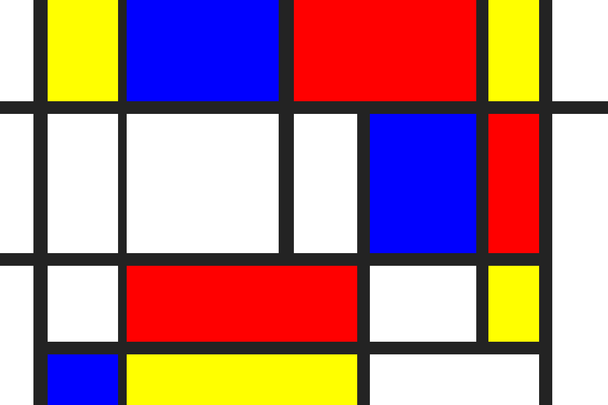

# Je eigen Mondriaan maken
Waarschijnlijk ken je de schilderijen van Piet Mondriaan wel. Één van zijn bekendste werken is een schilderij dat bestaat uit gekleurde vlakken.

In deze opdracht ga jij ook zo'n schilderij maken. Dat doe je door het CSV bestand in te lezen en de rechthoeken te tekenen die daarin beschreven staan.

De CSV bevat per regel een x-coordinaat, y-coordinaat, breedte, hoogte en kleur van het vlak. Let erop dat je de kleuren zelf moet omzetten van tekst (bijvoorbeeld RED) naar een Color die je in de SaxionApp kunt gebruiken (b.v ```Color.RED```)

Tip: Gebruik eventueel een class om de eigenschappen van een rechthoek in op te slaan.

## Voorbeeld uitvoer
Je schilderij zou er als volgt uit moeten zien.

